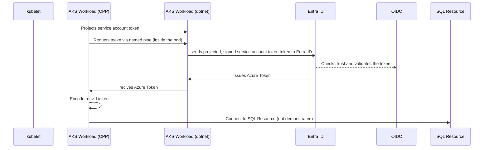

# Problem Description
An existing Visual C++ Application which is using the ODBC SQL Server Driver to
connect to a SQL Server, however the ODBC Driver currently doesn't support 
Workload Identity.

The AKS Cluster has a nodepool running that uses Windows Containers. The solution will need to support running on a windows container.
The challenge is to get an Azure AD access token that can bed encoded and passed to the `SQLSetConnectAttr` API call as per the documentation at

https://learn.microsoft.com/en-us/sql/connect/odbc/using-azure-active-directory?view=sql-server-ver16#authenticating-with-an-access-token

# Building the sample
To buuild the docker container, the sample code needs to be build and copied to the x64\release folder under the project root. 

Then the docker image can be built. The docker image uses a windows server core base with dotnet framework 6.0 installed. The C++ code is deployed to the same container, and a boot strap script is written to launch the dotnet server before starting the main application.

# Solution Explanation

The solution uses a dotnet console application which can be deployed into the same pod as the C++ host soluiton. Workload Identity takes care
of injecting the required properties as environment variables to the pod. The solutions uses named pipes as the IPC mechanism between the C++ 
solution and the dotnet component part. The solution requires the dotnet process to be started first which hosts the named pipe server

> [!NOTE] Azure Entra ID Token Expiration
> A: The token issued from AZure AD has an expiration time of 24 hours, after which the C++ application may need to 
> request a new token.

## Sequence diagram for the solution. 
AKS Workload (Cpp) and AKS Workload (dotnet) should be considered part of the same pod.

